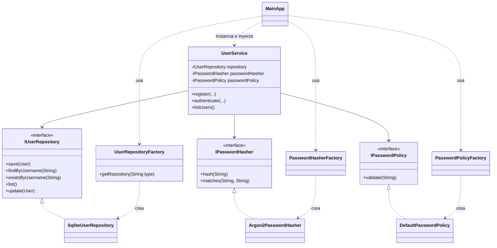

# Informe — Taller 2: Principios SOLID

**Universidad del Cauca — Facultad de Ingeniería Electrónica y Telecomunicaciones**
**Programa de Ingeniería de Sistemas — Laboratorio de Ingeniería de Software II**
**Periodo 2-2026**

**Integrantes:**
- Edward Dávila — edwarddavilas36@gmail.com
- Laura Isabel Sánchez Fernández

**Repositorio (GitHub):** https://github.com/DVLASZ/ingenieria-software-2
**Carpeta del taller:** [`Taller-02-SOLID/`](https://github.com/DVLASZ/ingenieria-software-2/tree/main/Taller-02-SOLID)

**Fecha de entrega de la guía:** martes 25 de agosto de 2026, 18:00

---

## 1. Resumen

Este documento presenta el desarrollo del Taller 2 del laboratorio de
Ingeniería de Software II, cuyo objetivo es **aplicar los principios SOLID
en el diseño de un sistema para garantizar su legibilidad y
modificabilidad**. Tomando como base el requerimiento "Gestión de
usuarios del sistema" del proyecto de curso (banco de preguntas para la
preparación de las pruebas Saber Pro), se implementó una aplicación de
escritorio en Java (Swing) con persistencia en SQLite que permite
registrar usuarios, autenticarlos y presentarles un tablero con opciones
según su rol.

## 2. Objetivo

Aplicar los principios SOLID para el diseño de un sistema de software
legible y fácil de mantener, siguiendo la arquitectura del ejemplo 5 de
Inversión de Dependencias (DIP) visto en la clase teórica.

## 3. Alcance funcional implementado

De acuerdo con las especificaciones técnicas obligatorias de la guía:

| Especificación | Estado | Dónde se implementa |
|---|---|---|
| Registro de usuarios (login, nombre completo, rol, estado, contraseña) | ✅ | `RegisterFrame`, `UserService.register(...)` |
| Rol: Administrador, Autor de preguntas, Revisor, Docente, Estudiante | ✅ | `Role` (enum) |
| Estado: Activo / Inactivo | ✅ | `UserStatus` (enum) |
| Contraseña: mínimo 6 caracteres, un dígito, un carácter especial, una mayúscula | ✅ | `IPasswordPolicy` / `DefaultPasswordPolicy` |
| Contraseña almacenada cifrada | ✅ | `IPasswordHasher` / `Argon2PasswordHasher` (Argon2id) |
| Autenticación (usuario/contraseña) | ✅ | `LoginFrame`, `UserService.authenticate(...)` |
| Tablero/menú según el rol | ✅ | `DashboardFrame`, `IMenuProvider` + `MenuProviderRegistry` |
| Persistencia en SQLite (archivo o memoria) | ✅ | `SqliteUserRepository` (archivo `saberpro.db` por defecto) |
| Interfaz gráfica de usuario | ✅ | Java Swing (`LoginFrame`, `RegisterFrame`, `DashboardFrame`) |

El manual de uso paso a paso (qué escribir en cada campo, reglas exactas
de la contraseña, mensajes de error) está en
[`GUIA_DE_USO.md`](GUIA_DE_USO.md).

## 4. Tecnologías utilizadas y justificación

| Tecnología | Uso | Justificación |
|---|---|---|
| Java 17 + Swing | Aplicación de escritorio | Tecnología sugerida por la guía; Swing no requiere dependencias externas para la interfaz gráfica. |
| Maven | Gestión de dependencias y build | Estándar para proyectos Java; permite `mvn test`/`mvn package` reproducibles y es el mismo que usa IntelliJ IDEA internamente. |
| SQLite (`org.xerial:sqlite-jdbc`) | Persistencia | Sugerida por la guía; no requiere instalar un servidor de base de datos aparte, ideal para un taller académico. Se usa en archivo físico (`saberpro.db`) para que los usuarios registrados persistan entre ejecuciones. |
| Argon2id (`de.mkammerer:argon2-jvm`) | Cifrado de contraseñas | Algoritmo de hashing de contraseñas recomendado actualmente (ganador del Password Hashing Competition), resistente a ataques por GPU/ASIC. Cumple el requisito de almacenamiento cifrado (RNF-08 del proyecto de curso). |
| JUnit 5 + Mockito | Pruebas automatizadas | Estándar de facto para pruebas unitarias en Java; Mockito permite aislar `UserService` de sus dependencias (repositorio, hasher, política) sin necesitar una base de datos real en cada prueba. |

## 5. Arquitectura y aplicación de los principios SOLID

El diseño replica la estructura del **ejemplo 5 de Inversión de
Dependencias** visto en la teoría (`IProductRepository` /
`ProductRepository` / `Factory` / `Service` / `ClientMain`), adaptada a la
gestión de usuarios:



`MainApp` es el **composition root**: el único lugar del proyecto donde se
decide qué implementación concreta usa cada abstracción. Todo lo demás
(`UserService`, `LoginFrame`, `RegisterFrame`, `DashboardFrame`) solo
conoce interfaces.

### S — Single Responsibility

Cada clase tiene una única razón para cambiar: `User` solo modela datos,
`Argon2PasswordHasher` solo cifra/verifica, `DefaultPasswordPolicy` solo
valida reglas de contraseña, `SqliteUserRepository` solo persiste,
`UserService` solo orquesta el caso de uso, y cada `*Frame` solo se
encarga de su pantalla.

### O — Open/Closed

- `IPasswordHasher` e `IPasswordPolicy` se pueden extender (nuevo
  algoritmo, nueva regla) creando una clase nueva y agregándola a su
  fábrica correspondiente, sin tocar `UserService`.
- `IMenuProvider` permite agregar un nuevo rol con su propio menú (nueva
  clase) sin modificar `DashboardFrame` ni `MenuProviderRegistry`.

### L — Liskov Substitution

Cualquier implementación de `IUserRepository`, `IPasswordHasher` o
`IMenuProvider` puede sustituir a otra sin romper a quien la usa: todas
respetan el mismo contrato. Por ejemplo, en las pruebas se reemplazan
`SqliteUserRepository`, `Argon2PasswordHasher` y `DefaultPasswordPolicy`
por dobles de prueba (mocks) sin modificar `UserService`.

### I — Interface Segregation

En vez de una interfaz "gorda" que mezclara persistencia, cifrado y
reglas de negocio, hay tres interfaces pequeñas y cohesivas:
`IUserRepository` (persistencia), `IPasswordHasher` (cifrado) e
`IPasswordPolicy` (reglas de contraseña). Ninguna implementación se ve
forzada a depender de métodos que no usa.

### D — Dependency Inversion

`UserService` (módulo de alto nivel) depende únicamente de las interfaces
`IUserRepository`, `IPasswordHasher` e `IPasswordPolicy` — nunca de
`SqliteUserRepository` ni de `Argon2PasswordHasher` directamente. Las
implementaciones concretas se obtienen a través de fábricas
(`UserRepositoryFactory`, `PasswordHasherFactory`,
`PasswordPolicyFactory`, cada una un singleton con un método
`getX(String type)`, igual que `Factory.getInstance().getRepository(...)`
en el ejemplo visto en clase) y se inyectan por constructor desde
`MainApp`.

## 6. Pruebas unitarias

Se implementaron 20 pruebas automatizadas (JUnit 5 + Mockito) distribuidas en 4 clases:

| Clase de prueba | Qué prueba | Nº de pruebas |
|---|---|---|
| `DefaultPasswordPolicyTest` | Reglas de complejidad de la contraseña (longitud, dígito, mayúscula, carácter especial) | 6 |
| `UserServiceTest` | Casos de uso de registro y autenticación, con `IUserRepository`, `IPasswordHasher` e `IPasswordPolicy` mockeados | 7 |
| `SqliteUserRepositoryTest` | Persistencia real contra una base de datos SQLite en memoria (guardar, buscar, listar, actualizar) | 4 |
| `Argon2PasswordHasherTest` | Que el hash difiera de la contraseña en texto plano y que la verificación funcione | 3 |

```bash
mvn test
```

Resultado: **20/20 pruebas pasan** (`Tests run: 20, Failures: 0, Errors: 0`).

## 7. Cómo ejecutar la aplicación

```bash
mvn package
java -jar target/taller02-solid.jar
```

Al iniciar se crea automáticamente el archivo `saberpro.db` (SQLite) con
el esquema de usuarios. El flujo de uso completo (qué escribir en cada
pantalla, reglas de la contraseña, mensajes de error) está documentado
paso a paso en [`GUIA_DE_USO.md`](GUIA_DE_USO.md).

## 8. Conclusiones

- Separar cada dependencia técnica (persistencia, cifrado, validación)
  detrás de una interfaz propia, en lugar de una única clase "de
  servicio" que lo haga todo, permitió probar la lógica de negocio
  (`UserService`) sin necesitar una base de datos real ni calcular hashes
  Argon2 de verdad en la mayoría de las pruebas.
- El uso de fábricas (`*Factory`) como único punto donde se decide la
  implementación concreta deja `MainApp` como el único lugar del proyecto
  que "sabe" que se está usando SQLite y Argon2; cambiar cualquiera de las
  dos tecnologías no requeriría tocar el resto del código.
- El principio que más impacto tuvo en la mantenibilidad fue el de
  Inversión de Dependencias (D), ya que ordenó todo el diseño alrededor
  de un único punto de composición, siguiendo fielmente la estructura del
  ejemplo 5 estudiado en la teoría.

## 9. URL del repositorio

https://github.com/DVLASZ/ingenieria-software-2 (carpeta `Taller-02-SOLID/`)
