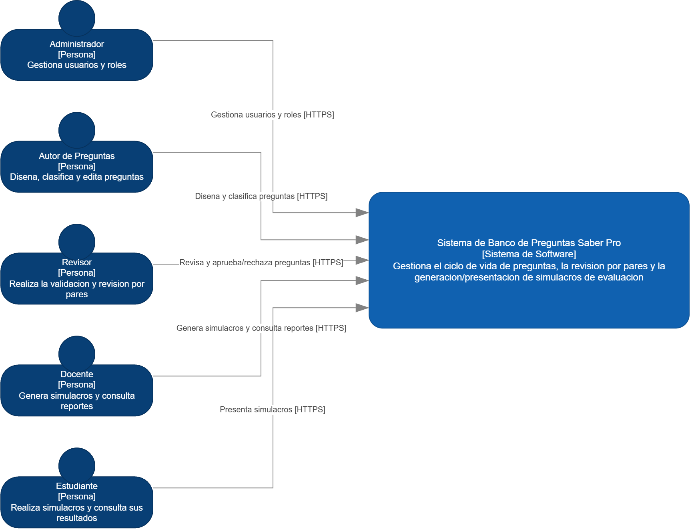
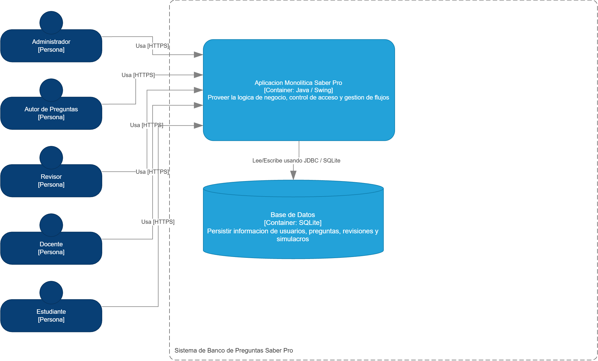
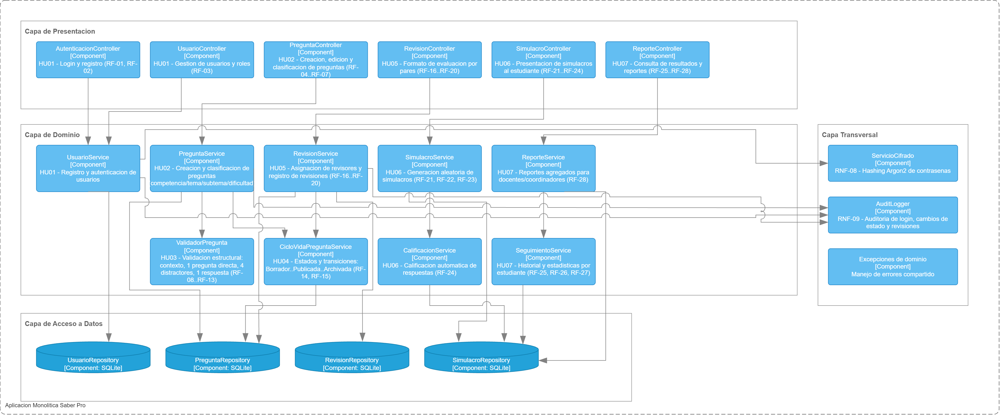
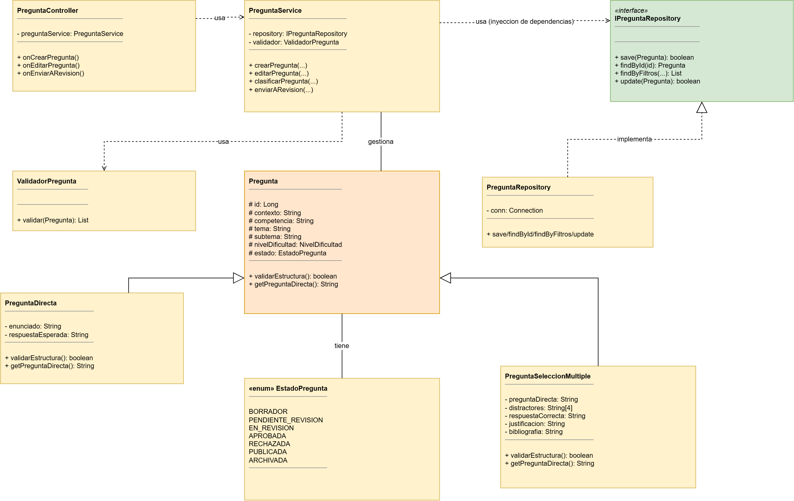

# Informe — Taller 3: Modelo C4

**Universidad del Cauca — Facultad de Ingeniería Electrónica y Telecomunicaciones**
**Programa de Ingeniería de Sistemas — Laboratorio de Ingeniería de Software II**
**Periodo 2-2026**

**Integrantes:**
- Edward Dávila — edwarddavilas36@gmail.com
- Laura Isabel Sánchez Fernández

**Repositorio (GitHub):** https://github.com/DVLASZ/ingenieria-software-2
**Carpeta del taller:** [`Taller-03-C4/`](https://github.com/DVLASZ/ingenieria-software-2/tree/main/Taller-03-C4)

---

## 1. Resumen

Este documento presenta el desarrollo del Taller 3 del laboratorio de
Ingeniería de Software II, cuyo objetivo es **modelar la arquitectura de
software del proyecto de curso usando el modelo C4** (Contexto,
Contenedores, Componentes y Código/Clases). El sistema modelado es el
**Sistema de Banco de Preguntas Saber Pro**, el mismo proyecto de curso
que ya viene desarrollándose en los talleres anteriores (la gestión de
usuarios de [Taller 2](../Taller-02-SOLID) es uno de sus componentes).

El taller se resolvió a partir de **dos guías** entregadas por la
docente: la guía general (Actividades 1 a 5, con la lista completa de
actores, funcionalidades e historias de usuario) y una guía paso a paso
posterior específica para diagrams.net, que exige construir los 4 niveles
usando la **biblioteca oficial C4** de la herramienta (no figuras
genéricas) y fija el componente de **Gestión de Preguntas** como objeto
del Nivel 4. Ambas guías se cruzaron entre sí para que el resultado final
incorporara todo lo pedido por las dos, documentando explícitamente los
puntos donde una completaba o precisaba a la otra.

Este informe reúne **toda** la información del taller (actores,
funcionalidades, historias de usuario, los 4 niveles del modelo C4 con
sus diagramas exportados, y las decisiones de diseño) en un único
documento, para que sea la única entrega necesaria además del archivo
fuente editable del diagrama.

## 2. Objetivo

Aplicar el modelo C4 para representar la arquitectura de un sistema de
software en distintos niveles de abstracción (Contexto, Contenedores,
Componentes y Clases), partiendo de los requisitos funcionales del
proyecto de curso y aplicando criterios de diseño orientado a objetos
(SOLID) en el nivel de código.

## 3. Metodología: cómo se cruzaron las dos guías

| Aspecto | Guía general (Actividades 1-5) | Guía paso a paso (diagrams.net) | Decisión tomada |
|---|---|---|---|
| Herramienta | No especifica una biblioteca en particular | Exige explícitamente la biblioteca oficial **C4** de diagrams.net (`+ Más formas → Software → C4`) | Se usó la biblioteca real, verificada abriéndola en vivo en el editor y copiando el estilo (`shape=mxgraph.c4.*`, colores oficiales) de cada figura antes de generar el archivo. |
| Actores del Nivel 1 | Lista 5 actores (los mismos roles de RF-03) | Su ejemplo agrupa "Autor de Preguntas / Docente" en una sola viñeta | Se mantuvieron los 5 actores de la Actividad 1, porque coinciden exactamente con los 5 roles del proyecto de curso y sus responsabilidades son distintas (Autor diseña preguntas, Docente genera simulacros y consulta reportes). |
| Nivel 4 (componente a detallar) | No indica cuál componente detallar en código | Pide explícitamente el componente de **Gestión de Preguntas**, con jerarquía `Pregunta` → `PreguntaDirecta` / `PreguntaSeleccionMultiple` para ilustrar OCP/LSP | Se detalló Gestión de Preguntas (no Gestión de usuarios, aunque esta última ya está implementada en el Taller 2). |
| Campo vs. clase `PreguntaDirecta` | Usa "Pregunta directa" como el **campo** que guarda el enunciado (RF-05) | Pide una **clase** `PreguntaDirecta` hermana de `PreguntaSeleccionMultiple` | Se conservaron ambos usos como identificadores distintos y sin conflicto: el método `getPreguntaDirecta(): String` en `Pregunta` (el enunciado de RF-05) y la clase `PreguntaDirecta` como segundo tipo concreto de pregunta (respuesta abierta corta), añadida para poder mostrar la jerarquía de herencia que pide la guía paso a paso. |
| Funcionalidades del Nivel 3 | Lista 13 funcionalidades mínimas (autenticación, gestión de preguntas, validación, revisión, ciclo de vida, simulacros, calificación, resultados, seguimiento, reportes...) | No detalla el número de componentes, solo el criterio de organizarlos en capas | Se mapeó **cada una de las 13 funcionalidades** a un componente propio en el Nivel 3 (en vez de agrupar varias en un solo componente genérico), separando por ejemplo calificación y seguimiento del desempeño en `CalificacionService` y `SeguimientoService`. |
| Formato de reporte | No detalla formato institucional | Pide entregar además un informe con formato institucional (plantilla de la universidad) | Se entrega este informe en dos formatos: Markdown (para el repositorio de GitHub) y Word (para pegar en la plantilla institucional y subir al Classroom). |

## 4. Actividad 1 — Actores, límites y funcionalidades del sistema

### 4.1 Actores del sistema

| Actor | Rol en el proyecto de curso | Qué hace en el sistema |
|---|---|---|
| **Administrador** | Rol `ADMINISTRADOR` | Gestiona usuarios (crea, activa/inactiva), asigna revisores a preguntas, configura el sistema y consulta reportes globales. |
| **Autor de preguntas** | Rol `AUTOR_PREGUNTAS` | Crea y edita preguntas mientras están en Borrador; las envía a revisión. |
| **Revisor** | Rol `REVISOR` | Evalúa las preguntas que le asignan, diligencia el formato de evaluación y aprueba o rechaza. |
| **Docente** | Rol `DOCENTE` | Genera simulacros para sus grupos y consulta reportes/estadísticas de sus estudiantes. |
| **Estudiante** | Rol `ESTUDIANTE` | Presenta simulacros y consulta su historial y sus estadísticas de desempeño. |

Los cinco actores corresponden exactamente a los cinco roles definidos en
RF-03 del proyecto de curso, así que no hay ambigüedad entre "actor" (el
rol de negocio) y "usuario del sistema" (el registro autenticado).

### 4.2 Límites del sistema

**Dentro del alcance:** registro/autenticación de usuarios, gestión y
clasificación de preguntas, validación estructural, ciclo de vida de
preguntas, revisión por pares, generación y presentación de simulacros,
calificación automática, consulta de resultados, seguimiento del
desempeño y generación de reportes.

**Fuera del alcance (según las restricciones del proyecto de curso):**
integraciones externas reales como envío de correos, SMS o WhatsApp; esas
funcionalidades, si se llegan a necesitar, se simulan dentro del propio
sistema. Por eso el diagrama de contexto (Nivel 1) no incluye sistemas
externos: para esta iteración, el sistema es autocontenido.

### 4.3 Funcionalidades principales y relación con los actores

| # | Funcionalidad | Actor(es) principal(es) |
|---|---|---|
| 1 | Autenticación | Todos |
| 2 | Gestión de usuarios | Administrador |
| 3 | Gestión de preguntas | Autor de preguntas |
| 4 | Clasificación de preguntas (competencia, tema, subtema, dificultad) | Autor de preguntas |
| 5 | Validación de preguntas | Sistema (automático, al guardar/enviar) |
| 6 | Revisión por pares | Revisor, Administrador (asigna) |
| 7 | Gestión del ciclo de vida de preguntas | Sistema / Administrador |
| 8 | Generación de simulacros | Docente |
| 9 | Presentación de simulacros | Estudiante |
| 10 | Calificación | Sistema (automático) |
| 11 | Consulta de resultados | Estudiante |
| 12 | Seguimiento del desempeño | Estudiante, Docente |
| 13 | Generación de reportes | Docente, Administrador |

### 4.4 Casos de uso / Historias de usuario

| ID | Actor(es) | Historia de usuario | Requisitos relacionados |
|---|---|---|---|
| HU-01 | Todos | Como usuario del sistema quiero autenticarme con usuario y contraseña para acceder solo a las funciones de mi rol. | RF-02, RF-03 |
| HU-02 | Todos (autoregistro) | Como usuario nuevo quiero registrarme indicando mi login, nombre completo, rol, estado y contraseña, para poder usar el sistema. | RF-01, RF-03 |
| HU-03 | Autor de preguntas | Como autor quiero crear una pregunta con contexto, pregunta directa, 4 distractores, respuesta correcta, justificación, bibliografía, competencia, tema, subtema y nivel de dificultad, para alimentar el banco de preguntas. | RF-04, RF-05 |
| HU-04 | Autor de preguntas | Como autor quiero editar una pregunta mientras esté en estado Borrador, para corregirla antes de enviarla a revisión. | RF-06 |
| HU-05 | Autor, Revisor, Docente, Administrador | Como usuario quiero consultar preguntas filtrando por competencia, tema, nivel de dificultad o estado, para encontrar rápidamente lo que necesito. | RF-07 |
| HU-06 | Sistema (automático) | Como sistema quiero validar que toda pregunta tenga contexto, una única pregunta directa, exactamente 4 distractores y una única respuesta correcta, para garantizar su calidad estructural. | RF-08, RF-09, RF-10, RF-11 |
| HU-07 | Sistema (automático) | Como sistema quiero rechazar preguntas que usen expresiones como "todas/ninguna de las anteriores" o cuyos distractores no cumplan criterios de longitud y gramática, para evitar preguntas de baja calidad. | RF-12, RF-13 |
| HU-08 | Sistema / Administrador | Como sistema quiero controlar los estados de una pregunta (Borrador, Pendiente de revisión, En revisión, Aprobada, Rechazada, Publicada, Archivada) y solo permitir transiciones válidas entre ellos. | RF-14, RF-15 |
| HU-09 | Administrador | Como administrador quiero asignar uno o más revisores a una pregunta pendiente, para iniciar el proceso de revisión por pares. | RF-16 |
| HU-10 | Revisor | Como revisor quiero diligenciar un formato de evaluación con observaciones y decidir si apruebo o rechazo una pregunta, para garantizar su calidad pedagógica. | RF-17, RF-18, RF-20 |
| HU-11 | Revisor, Autor, Administrador | Como usuario quiero consultar el historial de revisiones de una pregunta, para conocer su trayectoria de calidad. | RF-19 |
| HU-12 | Docente | Como docente quiero generar un simulacro seleccionando competencias, temas o niveles de dificultad, usando solo preguntas publicadas, para preparar a mis estudiantes. | RF-21, RF-22 |
| HU-13 | Estudiante | Como estudiante quiero presentar un simulacro dentro de un tiempo máximo definido, para practicar en condiciones similares a la prueba real. | RF-23 |
| HU-14 | Sistema (automático) | Como sistema quiero calificar automáticamente las respuestas de un simulacro al finalizar, para dar retroalimentación inmediata al estudiante. | RF-24 |
| HU-15 | Estudiante | Como estudiante quiero consultar mi historial de simulacros realizados, para revisar mi progreso en el tiempo. | RF-25 |
| HU-16 | Estudiante, Docente | Como estudiante o docente quiero ver estadísticas individuales y fortalezas/debilidades por competencia, para orientar el estudio. | RF-26, RF-27 |
| HU-17 | Docente, Administrador | Como docente o administrador quiero generar reportes agregados de desempeño de un grupo, para apoyar decisiones académicas. | RF-28 |
| HU-18 | Sistema (automático) | Como sistema quiero registrar quién y cuándo modifica cada pregunta, para mantener trazabilidad completa del banco de preguntas. | RF-29, RF-30 |

Estas 18 historias son la base de los 4 niveles del modelo C4 que siguen:
cada actor de la tabla 4.1 es una **Persona** en el diagrama de Contexto,
y cada bloque de historias relacionadas (gestión de preguntas, revisión,
simulacros, reportes...) se convierte en un **Componente** en el diagrama
de Componentes (Nivel 3).

## 5. Modelo C4 (Actividades 2 a 5)

Los cuatro niveles se construyeron **usando la biblioteca oficial C4** de
diagrams.net (`+ Más formas → Software → C4`: *Person*, *Software
System*, *Container*, *Component*, *Relationship*) y notación **UML**
estándar para el Nivel 4 — no son rectángulos genéricos coloreados a
mano: cada figura tiene el `shape=`/estilo exacto que trae la propia
paleta C4 del editor (verificado abriéndola en vivo y copiando el estilo
real de cada figura). El archivo fuente completo, editable y con las 4
pestañas, está en
[`diagramas/03-TallerC4-SaberPro.drawio`](diagramas/03-TallerC4-SaberPro.drawio).

### 5.1 Nivel 1 — Contexto

Responde: ¿quién usa el sistema?, ¿para qué?, ¿qué relación tiene cada
actor con el sistema?, ¿qué sistemas externos interactúan con él?

Se modelaron los 5 actores de la sección 4.1 (el mismo listado de roles
de RF-03), cada uno como figura **Person** de la paleta C4, con una
relación etiquetada hacia el sistema describiendo para qué lo usa. **No
se identifican sistemas externos**: las restricciones del proyecto de
curso indican que integraciones reales (correo, SMS, WhatsApp) no son
obligatorias y pueden simularse dentro del propio sistema.

> **Nota sobre la guía paso a paso:** su ejemplo de este nivel agrupa
> "Autor de Preguntas / Docente" en una sola viñeta, pero la
> responsabilidad que describe ("Diseña, clasifica y edita preguntas")
> corresponde solo al Autor — el Docente genera simulacros y consulta
> reportes (RF-21/RF-26), una función distinta. Se mantuvieron los 5
> actores de la sección 4.1 (que sí coinciden con los 5 roles de RF-03
> del proyecto de curso) en vez de fusionarlos.



**Figura 1.** Diagrama Nivel 1

### 5.2 Nivel 2 — Contenedores

La solución es un **monolito**. Dentro del **System Boundary** "Sistema de
Banco de Preguntas Saber Pro" hay dos contenedores:

| Contenedor | Tecnología | Responsabilidad |
|---|---|---|
| **Aplicación Monolítica Saber Pro** | Java / Swing | Proveer la lógica de negocio, control de acceso y gestión de flujos |
| **Base de Datos** | SQLite | Persistir información de usuarios, preguntas, revisiones y simulacros |

Los 5 actores quedan **fuera** del límite del sistema y se conectan hacia
el contenedor de aplicación; la aplicación se conecta a la base de datos
con la relación "Lee/Escribe usando JDBC / SQLite".



**Figura 2.** Diagrama Nivel 2

### 5.3 Nivel 3 — Componentes

Descompone el contenedor **Aplicación Monolítica Saber Pro** en sus
componentes internos, dentro de un **Container Boundary** con el mismo
nombre, organizados en 4 recuadros transparentes (capas lógicas, sección
*General* de diagrams.net). Esta versión mapea **las 13 funcionalidades
mínimas de la sección 4.3** una por una, cada componente rotulado con la
Historia de Usuario y los RF que implementa:

| Capa | Componentes (figura C4 *Component*) |
|---|---|
| **Presentación** | `AutenticacionController` (HU01), `UsuarioController` (HU01), `PreguntaController` (HU02), `RevisionController` (HU05), `SimulacroController` (HU06), `ReporteController` (HU07) |
| **Dominio — fila 1** (con controlador propio) | `UsuarioService`, `PreguntaService`, `RevisionService`, `SimulacroService`, `ReporteService` |
| **Dominio — fila 2** (colaboradores internos) | `ValidadorPregunta` (HU03), `CicloVidaPreguntaService` (HU04), `CalificacionService` (HU06 — calificación, RF-24), `SeguimientoService` (HU07 — historial/estadísticas por estudiante, RF-25..27) |
| **Acceso a Datos** | `UsuarioRepository`, `PreguntaRepository`, `RevisionRepository`, `SimulacroRepository` (figura *Container: Database*, SQLite) |
| **Transversal** | `ServicioCifrado` (RNF-08, hashing Argon2), `AuditLogger` (RNF-09), Excepciones de dominio |

**Por qué se separaron `CalificacionService` y `SeguimientoService` de
`SimulacroService`/`ReporteService`:** la guía general lista "Generación
de simulacros", "Presentación de simulacros" y "Calificación" como *tres*
funcionalidades distintas (HU06), y "Consulta de resultados" y
"Seguimiento del desempeño" como parte de HU07 junto con "Generación de
reportes" — separarlos en componentes propios hace el diagrama fiel a esa
lista en vez de mezclar responsabilidades distintas en un solo
componente.

**Regla de oro aplicada:** todas las flechas de dependencia van
estrictamente de arriba hacia abajo (Presentación → Dominio → Acceso a
Datos); la Capa Transversal es alcanzada únicamente desde Dominio (fila
1), evitando acoplamiento bidireccional.



**Figura 3.** Diagrama Nivel 3

### 5.4 Nivel 4 — Código / Clases (Gestión de Preguntas)

Componente elegido: **Gestión de Preguntas** (el que pide explícitamente
la guía paso a paso). A diferencia de la gestión de usuarios del
[Taller 2](../Taller-02-SOLID) — ya implementada —, este es el **diseño**
de un componente que el proyecto de curso aún no tiene codificado.

| Principio | Cómo se aplica |
|---|---|
| **SRP** | `PreguntaController` (presentación), `PreguntaService` (dominio), `ValidadorPregunta` (validación estructural) y `PreguntaRepository` (datos) tienen cada uno un único propósito. |
| **DIP** | `PreguntaService` depende únicamente de la interfaz `IPreguntaRepository` (inyección de dependencias), nunca de `PreguntaRepository` directamente. `PreguntaRepository` *implementa* `IPreguntaRepository` (flecha discontinua, punta hueca — realización UML). |
| **OCP / LSP** | `Pregunta` es una clase abstracta; `PreguntaDirecta` y `PreguntaSeleccionMultiple` heredan de ella (flecha continua, punta hueca — generalización UML) sin alterar su contrato. Añadir un nuevo tipo de pregunta no requiere modificar `Pregunta` ni `PreguntaService`. |

#### Campos de `Pregunta` — combinando el ejemplo de ambas guías

La guía general ilustra esta descomposición conceptual:

```
PreguntaController → PreguntaService → { ValidadorPregunta, PreguntaRepository }
                                      → Pregunta { Contexto, PreguntaDirecta, Distractor }
```

Es decir, usa **"PreguntaDirecta" como el nombre del campo** que guarda el
enunciado de la pregunta (RF-05: *Contexto, Pregunta directa, Cuatro
distractores...*), mientras que la guía paso a paso pide una **clase**
llamada `PreguntaDirecta` como subtipo hermano de `PreguntaSeleccionMultiple`
(herencia para OCP/LSP). Ambas cosas conviven sin conflicto real:

- `Pregunta` (abstracta) tiene el campo compartido `contexto` y el método
  `getPreguntaDirecta(): String` (el "enunciado" de RF-05).
- `PreguntaSeleccionMultiple` (el formato que exige RF-05: contexto + 1
  pregunta directa + 4 distractores + 1 respuesta correcta) tiene el
  campo `preguntaDirecta`, `distractores[4]`, `respuestaCorrecta`,
  `justificacion`, `bibliografia`.
- `PreguntaDirecta` (la **clase**, segundo tipo concreto) es una pregunta
  de respuesta abierta corta — no es un requisito de RF-05, se incluyó
  específicamente para poder mostrar la jerarquía OCP/LSP que pide la
  guía paso a paso: la prueba de que la arquitectura admite nuevos tipos
  de pregunta sin tocar código existente.

#### Elementos añadidos para que el nivel quede completo

- **`ValidadorPregunta`**: se dibuja como clase colaboradora de
  `PreguntaService` — cierra la referencia y muestra la validación
  estructural de HU03 (RF-08..RF-13) también a nivel de código.
- **`«enum» EstadoPregunta`**: `BORRADOR`, `PENDIENTE_REVISION`,
  `EN_REVISION`, `APROBADA`, `RECHAZADA`, `PUBLICADA`, `ARCHIVADA` — el
  ciclo de vida exacto de RF-14, visible como tipo del atributo `estado`
  de `Pregunta`, ligando el Nivel 4 con `CicloVidaPreguntaService` del
  Nivel 3.

#### Correspondencia con los niveles anteriores

| Elemento del Nivel 4 | Elemento del Nivel 3 |
|---|---|
| `PreguntaController` | Componente `PreguntaController` (Capa de Presentación) |
| `PreguntaService`, `ValidadorPregunta` | Componentes de la Capa de Dominio (fila 1 y 2) |
| `Pregunta.estado: EstadoPregunta` | Componente `CicloVidaPreguntaService` (Capa de Dominio) |
| `IPreguntaRepository` / `PreguntaRepository` | Componente `PreguntaRepository` (Capa de Acceso a Datos) |



**Figura 4.** Diagrama Nivel 4

## 6. Conclusiones

- Cruzar las dos guías en vez de resolver solo la más reciente evitó
  perder información: la guía general aporta la lista completa de
  funcionalidades e historias de usuario que sustentan el Nivel 3, y la
  guía paso a paso aporta el requisito estricto de usar la biblioteca C4
  real y el componente concreto a detallar en el Nivel 4.
- Modelar el Nivel 3 con un componente por cada funcionalidad mínima (en
  vez de agrupar varias HU en un componente genérico) deja el diagrama
  trazable 1 a 1 contra la Actividad 1, lo que facilita justificar
  cualquier decisión de diseño ante la docente.
- Aplicar SOLID también en el nivel de diseño (Nivel 4), antes de escribir
  código, permite detectar temprano dónde conviene una interfaz
  (`IPreguntaRepository`) o una jerarquía de herencia (`Pregunta`) sin
  haber invertido tiempo en una implementación que luego habría que
  refactorizar.

## 7. URL del repositorio

https://github.com/DVLASZ/ingenieria-software-2 (carpeta `Taller-03-C4/`)
